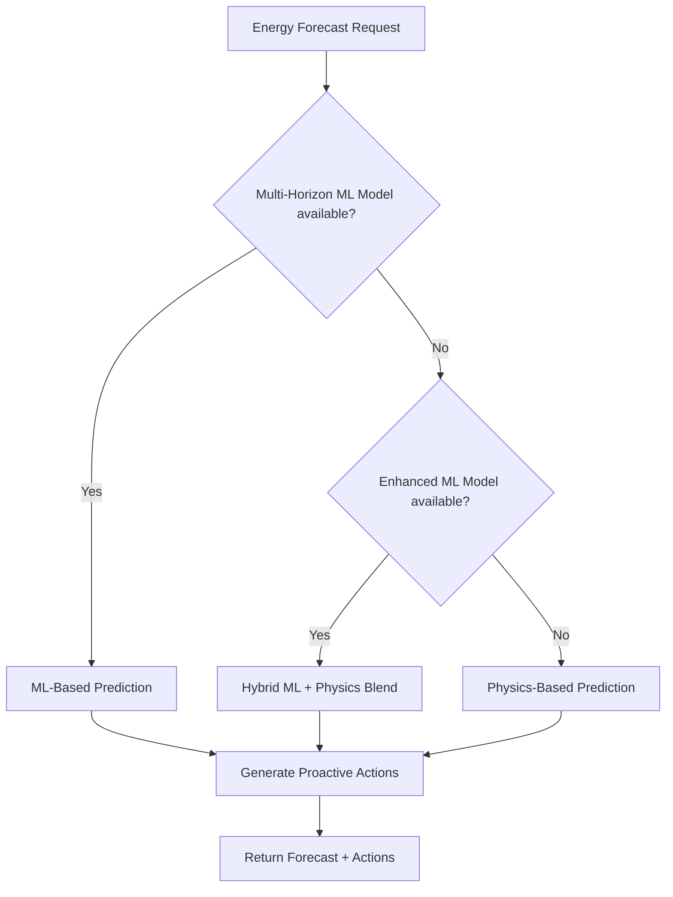

# FarmInsight-AI-Backend

A Django-based AI service that provides machine learning predictions for FarmInsight Food Production Facilities.

## Table of Contents

- [The FarmInsight Project](#the-farminsight-project)
- [Overview](#overview)
  - [Built with](#built-with)
- [Features](#features)
- [Model Documentation](#model-documentation)
  - [Model Selection Strategy](#model-selection-strategy)
  - [🌱 Water Model](#-water-model)
  - [⚡ Energy Model](#-energy-model)
- [Development Setup](#development-setup)
- [Running the Application](#running-the-application)
- [API Endpoints](#api-endpoints)
- [Model Training](#model-training)
- [Contributing](#contributing)
- [License](#license)

## The FarmInsight Project

Welcome to the FarmInsight Project by ETCE!

The FarmInsight platform brings together advanced monitoring of "Food Production Facilities" (FPF), enabling users to
document, track, and optimize every stage of food production seamlessly.

All FarmInsight Repositories:

- <a href="https://github.com/ETCE-LAB/FarmInsight-Dashboard-Frontend">Dashboard-Frontend</a>
- <a href="https://github.com/ETCE-LAB/FarmInsight-Dashboard-Backend">Dashboard-Backend</a>
- <a href="https://github.com/ETCE-LAB/FarmInsight-FPF-Backend">FPF-Backend</a>
- <a href="https://github.com/ETCE-LAB/FarmInsight-AI-Backend">AI-Backend</a>
Link to our deployed System: <a href="https://farminsight.etce.isse.tu-clausthal.de"> FarmInsight.etce.isse.tu-clausthal.de</a>

## Overview

The AI-Backend provides predictive models for FarmInsight. It runs as an independent service that the Dashboard-Backend queries periodically for forecasts. Currently supported model types:

- **Water Model**: Predicts water tank levels, soil moisture. and optimal irrigation plans
- **Energy Model**: Forecasts battery state-of-charge (SoC), solar production, and proactive energy actions

The service exposes a standardized REST API that allows easy integration of new model types.

### Built with

[![Python][Python-img]][Python-url] <br>
[![Django][Django-img]][Django-url] <br>
[![Scikit-Learn][Sklearn-img]][Sklearn-url]

Additional ML libraries: **LightGBM** (Water Model), **scikit-learn GradientBoostingRegressor** (Energy Model)

## Features

- **Water Level & Soil Moisture Forecasting**: Physics-first hybrid model with ML residual correction, including best/average/worst-case scenarios
- **Energy Forecasting**: Battery SoC & solar production predictions with multi-scenario support (expected/optimistic/pessimistic)
- **Proactive Actions**: Water model recommends optimal irrigation schedules; Energy model triggers grid-connection when battery drops below threshold
- **Weather Integration**: Live weather forecasts from [Open-Meteo](https://open-meteo.com/) (free, no API key), historical weather from Open-Meteo Archive API and DWD
- **Beam Search Optimization**: Intelligent irrigation plan optimization using beam search instead of exponential enumeration
- **Conformal Prediction**: Quantile-based uncertainty intervals for scenario generation without model retraining
- **REST API**: Standardized endpoints for easy Dashboard-Backend integration
- **Model Training**: Endpoints to trigger retraining with new data

---

## Model Documentation

### Model Selection Strategy

Both models follow a **tiered approach** that selects different model types depending on the amount and quality of available training data:

| Data Availability | Water Model Strategy | Energy Model Strategy |
|---|---|---|
| **No data / minimal data** | Pure physics model (TankPhysics + SoilPhysics equations) | Physics-based energy balance (charging rates calibrated from historical data per month) |
| **Some data (~25+ days)** | Physics + ML (LightGBM quantile regression for residual correction) | GradientBoosting / RandomForest single-step model |
| **Sufficient data (~100+ days)** | Physics + ML + Conformal Prediction uncertainty intervals | Multi-horizon ML model (separate models per forecast horizon, backtest-validated) |
| **Synthetic data available** | Synthetic data generation for bootstrap training when real data is scarce | — |

This ensures that the system provides **useful predictions even before enough training data is collected**, and improves accuracy progressively as more data becomes available.

---

### 🌱 Water Model

The Water Model predicts **tank water levels** and **soil moisture** for a configurable forecast period (default: 7 days), and computes **optimal irrigation plans** across three scenarios.

#### Architecture: Physics-First Hybrid Approach

The Water Model employs a **physics-first, ML-residual** architecture. Core physical equations are used to compute a baseline prediction, and a machine learning model provides bounded residual corrections on top:

```
Prediction = Physics_Baseline + clamp(ML_Residual, ±20% of physics value)
```

This ensures that the ML model can **never override** physical constraints (e.g., water conservation, tank capacity limits).

##### Physics Models

1. **TankPhysics** (`physics_model.py`) — Mass-balance based tank level calculation:

   ```
   tank_level_new = tank_level_prev + inflow - outflow - evaporation_loss
   ```

   - Clips values to `[0, tank_capacity]`
   - Tracks overflow separately

2. **SoilPhysics** (`physics_model.py`) — Bucket/ET0-proxy soil moisture model:

   ```
   soil_new = soil_prev + k_irrig × irrigation_mm + k_rain × rain_mm - k_evap × (temp / 30)
   ```

   - Coefficients: `k_irrig = 1.5`, `k_rain = 0.3`, `k_evap = 0.4`
   - ML corrections bounded to max ±20% of the physics value
   - Output clipped to `[0%, 100%]`

##### ML Model: LightGBM Quantile Regression

- **Algorithm**: `MultiOutputRegressor(LGBMRegressor)` with quantile loss
- **Quantiles trained**: Q10 (pessimistic), Q50 (median), Q90 (optimistic)
- **Target**: Residuals (difference between true values and physics predictions)
- **Hyperparameter tuning**: `GridSearchCV` with `TimeSeriesSplit` cross-validation
- **Model storage**: Serialized via `joblib` to `trained_models/synthetic_quantile_q{10,50,90}.pkl`

#### Input Data

The Water Model receives the following input data:

| Input | Source | Type | Description |
|---|---|---|---|
| `soil_moisture` | FPF Sensor | float (%) | Current soil moisture reading |
| `water_level` | FPF Sensor | float (L) | Current water tank level in liters |
| `soil_moisture_prev` | Derived | float (%) | Previous day's soil moisture |
| `water_level_prev` | Derived | float (L) | Previous day's water level |
| `day_of_year` | System | int | Day of year (1–366) |
| `month` | System | int | Month (1–12) |
| `temp_today` | Open-Meteo / DWD | float (°C) | Today's max temperature |
| `rain_today` | Open-Meteo / DWD | float (mm) | Today's rain amount |
| `temp_tomorrow` | Open-Meteo | float (°C) | Tomorrow's max temperature (forecast) |
| `rain_tomorrow` | Open-Meteo | float (mm) | Tomorrow's rain (forecast) |
| `irrigation_last_h_days` | Derived | float (L) | Total irrigation over last 7 days |
| `pump_usage` | FPF System | int (0/1/2) | Current pump activation level |
| `inflow_forecast_l_today` | Computed | float (L) | Greenhouse roof rainwater inflow |

**Rain inflow computation** (`greenhouse_calculator.py`):

The rainwater inflow is computed using a **physics-based greenhouse roof model** that accounts for:

- Roof geometry (slope angle `30.26°`, face azimuth `30°`, face area `6.668 m²`)
- Wind direction bias (affects rain distribution on roof faces A/B)
- Runoff coefficient (`0.9`) and first-flush loss (`3%`)
- Wind exposure factors per roof face

**Weather data sources**:

- **Training**: Historical weather from [Open-Meteo Archive API](https://open-meteo.com/) (temperature, rain, wind direction, sunshine) — no API key required
- **Inference**: Live forecasts from [Open-Meteo Forecast API](https://open-meteo.com/) (daily: rain, temperature, wind direction)

#### Output Data

| Output | Unit | Description |
|---|---|---|
| `tank_l` | Liters | Predicted tank water level |
| `qin_l` | Liters | Water inflow (rainwater) |
| `qout_l` | Liters | Water outflow (irrigation) |
| `overflow_l` | Liters | Tank overflow |
| `soil_mm` | % | Predicted soil moisture |
| `irrigation_mm` | mm | Irrigation amount applied |
| `pump_usage` | 0/1/2 | Recommended pump activation level |

#### Scenarios & Uncertainty

The model generates **three scenarios** using **Conformal Prediction** (preferred) or legacy multipliers:

| Scenario | Quantile | Method |
|---|---|---|
| **best_case** | Q90 (optimistic) | Adds 90th percentile residual to prediction |
| **average_case** | Q50 (median) | Baseline physics + median ML correction |
| **worst_case** | Q10 (pessimistic) | Adds 10th percentile residual to prediction |

**Legacy multiplier fallback** (when conformal prediction is disabled):

- Best case: temp ×0.9, rain ×1.1, inflow ×1.1
- Worst case: temp ×1.1, rain ×0.9, inflow ×0.9

#### Optimization: Beam Search

Irrigation plan optimization uses **beam search** (`beam_search.py`) instead of exponential plan enumeration:

- **Beam width**: 200 candidates (default), greedy fallback for >14 day forecasts
- **Adaptive beam**: Larger beam early in forecast, smaller later (enabled by default)
- **Scoring function**: Multi-objective with weights for:
  - Moisture deficit penalty (α = 10.0)
  - Irrigation cost (β = 0.1)
  - Final tank level reward (γ = 0.3)
  - Overflow penalty (δ = 1.0)

---

### ⚡ Energy Model

The Energy Model predicts **battery state-of-charge (SoC)** in Watt-hours and **solar energy production** for up to 14 days (336 hours), including proactive energy management actions.

#### Architecture: Multi-Tier with ML & Physics Fallback

The Energy Model uses a **cascade of prediction strategies**:



##### Tier 1: Multi-Horizon ML Model (`_ml_battery_forecast`)

- **When**: Trained model file `energy_forecast_models.pkl` exists
- **Algorithm**: Separate models per forecast horizon (e.g., +1h, +3h, +6h), currently uses +1h for iterative prediction
- **Method**: Iterative — predict 1 hour ahead, use prediction as input for next hour
- **Features**: 16 engineered features (see table below)
- **Validated**: With backtesting on historical data

##### Tier 2: Enhanced ML Model (`predict_with_ml_model`)

- **When**: `energy_model.pkl` + `energy_scaler.pkl` exist
- **Algorithm**: `GradientBoostingRegressor` (scikit-learn) or `RandomForestRegressor`
- **Method**: Hybrid blend with **time-decay**:

  ```
  SoC = ml_weight × time_decay × ML_prediction + (1 - ml_weight × time_decay) × Physics_prediction
  ```

  - Expected: ML weight 60%, Optimistic: 40%, Pessimistic: 30%
  - `time_decay = max(0.3, 1.0 - (hour / 336))` — ML influence decreases over time
- **Features**: 22 engineered features including temporal, weather, lag, and rolling statistics

##### Tier 3: Physics-Based Fallback (`_simple_battery_forecast`)

- **When**: No ML models available
- **Method**: Uses historically calibrated monthly charging rates and consumption patterns:
  - **Charging window**: 9:00–12:00 local time (site-specific, terrain-dependent)
  - **Charging rates by month** (from historical analysis):

    | Month | Charging Rate (Wh/hour) | Note |
    |---|---|---|
    | Jan | 30 | Minimal winter sun |
    | Feb | 40 | — |
    | Mar | 50 | — |
    | Apr | 60 | — |
    | May | 70 | — |
    | Jun | 80 | High sun partially blocked by terrain |
    | Jul | 56 | Measured: 55.9 Wh/h |
    | **Aug** | **91** | **Measured: 91.0 Wh/h — lower sun angle clears terrain better** |
    | **Sep** | **96** | **Measured: 95.5 Wh/h — peak performance** |
    | Oct | 61 | Measured: 60.7 Wh/h |
    | Nov | 24 | Measured: 24.0 Wh/h |
    | Dec | 20 | Estimated |

  - **Consumption rates**: Night (~5 Wh/h), Day (~20 Wh/h), Battery drain average ~12 Wh/h

#### Input Data

##### ML Model Features (Multi-Horizon, Tier 1)

| Feature | Type | Description |
|---|---|---|
| `capacity_wh` | float (Wh) | Current battery SoC in Watt-hours |
| `power_watts` | float (W) | Current power consumption (~12 W average) |
| `hour_sin`, `hour_cos` | float | Cyclical encoding of hour of day |
| `month_sin`, `month_cos` | float | Cyclical encoding of month |
| `shortwave_radiation` | float (W/m²) | Shortwave solar radiation from Open-Meteo |
| `cloud_cover` | float (%) | Cloud cover percentage from Open-Meteo |
| `sunshine_minutes` | float (min) | Sunshine duration per hour from Open-Meteo |
| `effective_sunshine` | float | `sunshine_minutes × in_solar_window` |
| `in_solar_window` | boolean (0/1) | 1 if hour ∈ [7, 11], else 0 |
| `capacity_lag_1h` | float (Wh) | Battery SoC 1 hour ago |
| `capacity_lag_3h` | float (Wh) | Battery SoC 3 hours ago |
| `capacity_lag_6h` | float (Wh) | Battery SoC 6 hours ago |
| `capacity_rolling_6h` | float (Wh) | Rolling mean SoC over last 6 hours |
| `capacity_rolling_24h` | float (Wh) | Rolling mean SoC over last 24 hours |

##### Enhanced ML Features (Tier 2, additional)

| Feature | Type | Description |
|---|---|---|
| `dow_sin`, `dow_cos` | float | Cyclical encoding of day of week |
| `capacity_lag_12h`, `capacity_lag_24h` | float (Wh) | Extended lag features |
| `power_rolling_6h`, `power_rolling_24h` | float (W) | Rolling power consumption averages |
| `radiation_rolling_6h` | float (W/m²) | Rolling radiation average |

##### API Parameters (received from Dashboard-Backend)

| Parameter | Type | Default | Description |
|---|---|---|---|
| `latitude` | float | 51.9 | Location latitude for weather forecast |
| `longitude` | float | 10.4 | Location longitude for weather forecast |
| `forecast_hours` | int | 336 | Forecast period in hours (14 days) |
| `max_solar_output_watts` | float | 600 | Maximum solar panel output in watts |
| `avg_consumption_watts` | float | 50 | Average power consumption (auto-injected from consumers) |
| `initial_soc_wh` | float | 800 | Current battery SoC (auto-injected from battery sensor) |
| `battery_max_wh` | float | 1600 | Maximum battery capacity in Wh |

**Training data sources**:

- **Battery capacity**: `Anker Daten ALL Kapazität in Wh.json` — historical Anker Solar Bank capacity readings
- **Power consumption**: `Power Daten ALL Vebrauch in Watt.json` — historical power consumption in Watts
- **Weather**: Historical hourly data from [Open-Meteo Archive API](https://open-meteo.com/) (shortwave radiation, cloud cover, sunshine duration, temperature, humidity) — no API key required
- **Location**: Goslar (51.90°N, 10.43°E, 289m elevation)

#### Output Data

| Output | Unit | Description |
|---|---|---|
| **Battery SoC Forecast** | Wh | Hourly predicted battery state-of-charge |
| **Solar Production** | Wh | Hourly estimated solar energy production |

Both outputs include **three scenarios**: `expected`, `optimistic`, `pessimistic`.

#### Scenario Generation

| Scenario | Solar Factor | Consumption Factor | ML Charge Bonus (solar hours) |
|---|---|---|---|
| **expected** | ×1.0 | ×1.0 | ±0 Wh |
| **optimistic** | ×1.4 | ×0.75 | +30 Wh/h |
| **pessimistic** | ×0.5 | ×1.35 | −20 Wh/h |

Additionally, weather inputs are adjusted per scenario (cloud cover ±20–30%, sunshine ×0.5–1.3).

#### Proactive Actions

The Energy Model generates **proactive energy management actions**:

| Action | Trigger | Description |
|---|---|---|
| `connect_grid = true` | Predicted SoC < **15%** | Connect FPF to electrical grid to prevent battery depletion |
| `connect_grid = false` | Predicted SoC > **50%** (after grid was connected) | Disconnect grid, battery has recovered |

Actions are scheduled **2 hours before** the threshold is predicted to be hit (buffer time for Dashboard-Backend to execute the action).

> **Note**: Individual consumer shutdowns (e.g., turning off specific equipment when battery is low) are handled by the **Dashboard-Backend** based on per-consumer threshold configuration, not by the AI-Backend.

#### Site Configuration

The Energy Model includes site-specific calibration (`site_config.py`) for the Goslar installation:

- **Site shading factor**: `0.35` — only 35% of theoretical solar radiation reaches the panels (terrain/building shading)
- **Effective solar window**: 9:00–12:00 local time (peak at 10:00–11:00)
- **Battery specs**: Anker Solar Bank, 1600 Wh max, 160 Wh practical minimum (10%)
- **Seasonal calibration**: Monthly solar factors derived from real measurements (Aug/Sep are peak months due to low sun angle clearing terrain)

---

## Development Setup

### Prerequisites

- Python 3.13 or higher
- `pip` (Python package manager)
- `virtualenv` (recommended for isolated environments)

### Step-by-Step Guide

1. Navigate to the model_service directory:

```bash
cd model_service
```

1. Create and activate a virtual environment:

```bash
python -m venv .venv
source .venv/bin/activate  # Linux/Mac
# or
.venv\Scripts\activate     # Windows
```

1. Install the required dependencies:

```bash
pip install -r requirements.txt
```

## Running the Application

Start the development server:

```bash
python manage.py runserver 8002
```

The default port is `8002` to avoid conflicts with other FarmInsight services.

## API Endpoints

### Water Model

| Method | Endpoint | Description |
|--------|----------|-------------|
| GET | `/water/params` | Returns model configuration and input parameters |
| GET | `/water/farm-insight` | Returns water level & soil moisture forecasts with optimal irrigation plans |
| POST | `/water/train` | Triggers model retraining with latest sensor data |

### Energy Model

| Method | Endpoint | Description |
|--------|----------|-------------|
| GET | `/energy/params` | Returns model configuration and input parameters |
| GET | `/energy/farm-insight` | Returns battery SoC & solar production forecasts with proactive actions |
| POST | `/energy/train` | Triggers model retraining (prepares training data from JSON + weather, trains GradientBoosting model) |

### Health Check

| Method | Endpoint | Description |
|--------|----------|-------------|
| GET | `/alive` | Returns 200 if service is running |

## Model Training

Trained models are stored in `model_service/model_service/trained_models/`.

### Water Model Training

```bash
python train_hybrid_model.py  # Train LightGBM quantile regression models
```

**Output files**:

- `synthetic_quantile_q10.pkl` — Pessimistic scenario model
- `synthetic_quantile_q50.pkl` — Median (expected) model
- `synthetic_quantile_q90.pkl` — Optimistic scenario model

Training uses `TimeSeriesSplit` cross-validation with `GridSearchCV` for hyperparameter tuning. Supports training on **real** or **synthetic** data (generated via `synthetic_historical_data.py` when real data is insufficient).

### Energy Model Training

Via the `/energy/train` API endpoint or manually:

```bash
cd model_service
python -m model_service.utils.energy_model_trainer
```

**Pipeline**:

1. Load battery capacity data (`Anker Daten ALL Kapazität in Wh.json`) and power data (`Power Daten ALL Vebrauch in Watt.json`)
2. Resample to hourly intervals, merge by timestamp
3. Fetch historical weather from Open-Meteo Archive API
4. Engineer features: cyclical temporal encoding, lag features (1h, 3h, 6h, 12h, 24h), rolling statistics (6h, 24h)
5. Target: `capacity_next_hour` (SoC one hour in the future)
6. Time-series split (80/20), `StandardScaler`, train `GradientBoostingRegressor`
7. Save model, scaler, and metadata

**Output files**:

- `energy_model.pkl` — Trained GradientBoosting model
- `energy_scaler.pkl` — StandardScaler for feature normalization
- `energy_model_metadata.pkl` — Training metrics and feature importance

## 🔄 Contribute to FarmInsight

We welcome contributions! Please follow these steps:

1. Fork the repository.
2. Create a new branch: `git checkout -b feature/your-feature`
3. Make your changes and commit them: `git commit -m 'Add new feature'`
4. Push the branch: `git push origin feature/your-feature`
5. Create a pull request.

## Past/Present Contributors

This project was developed as part of the Digitalisierungsprojekt at DigitalTechnologies WS24/25 by:

- Tom Luca Heering
- Theo Lesser
- Mattes Knigge
- Julian Schöpe
- Marius Peter
- Paul Golke
- Niklas Schaumann
- M. Linke

Project supervision:

- Johannes Mayer
- Benjamin Leiding

## License

This project is licensed under the [AGPL-3.0](https://www.gnu.org/licenses/agpl-3.0.html) license.

<!-- MARKDOWN LINKS & IMAGES -->
[Python-img]: https://img.shields.io/badge/python-3670A0?style=for-the-badge&logo=python&logoColor=ffdd54
[Python-url]: https://www.python.org/
[Django-img]: https://img.shields.io/badge/django-%23092E20.svg?style=for-the-badge&logo=django&logoColor=white
[Django-url]: https://www.djangoproject.com/
[Sklearn-img]: https://img.shields.io/badge/scikit--learn-%23F7931E.svg?style=for-the-badge&logo=scikit-learn&logoColor=white
[Sklearn-url]: https://scikit-learn.org/

---
For more information or questions, please contact the ETCE-Lab team.
